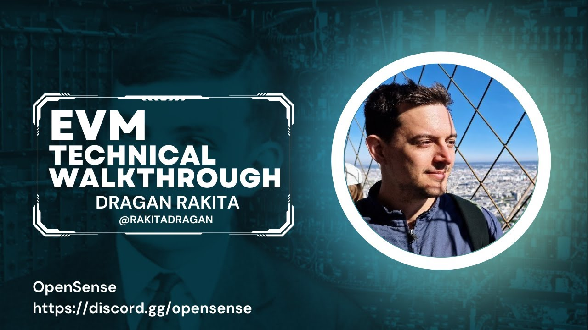

# [**EVM** Technical walkthrough with Dragan Rakita](https://youtu.be/Nh19f_2fWLc) 

- [Dragan Rakita (@rakitadragan)](https://x.com/rakitadragan)
- [draganrakita | draganrakita](http://rakita.github.io/blog/)
- [**EVM** Technical walkthrough - Google Slides](https://docs.google.com/presentation/d/1r4dutdMh_hv6jKvUTUUD8uAPUAAbGbpIxRAvoari0_o/edit#slide=id.p)
- [OpenSense](https://discord.gg/opensense)

In this video, **Dragan Rakita** will take a technical walkthrough of the **Ethereum Virtual Machine**. He will start by discussing the inputs and database of the **EVM**, and then move on to the host and interpreter. We will also cover the **EVM diagram**, how the interpreter works, the interpreter code, opcodes, CREATE & CREATE2, call opcodes, logs, gas, traces, inspector, how the host works, subroutine, host trait, pre-compiles, hardforks and finally optimizations.

- [00:03:03](https://www.youtube.com/watch?v=Nh19f_2fWLc&t=183s) Inputs & database
- [00:06:20](https://www.youtube.com/watch?v=Nh19f_2fWLc&t=380s) Host and interpreter
- [00:07:57](https://www.youtube.com/watch?v=Nh19f_2fWLc&t=477s) **EVM** diagram
- [00:10:09](https://www.youtube.com/watch?v=Nh19f_2fWLc&t=609s) How the interpreter works
- [00:13:57](https://www.youtube.com/watch?v=Nh19f_2fWLc&t=837s) Interpreter code
- [00:14:44](https://www.youtube.com/watch?v=Nh19f_2fWLc&t=884s) OpCodes
- [00:15:46](https://www.youtube.com/watch?v=Nh19f_2fWLc&t=946s) CREATE & CREATE2
- [00:16:14](https://www.youtube.com/watch?v=Nh19f_2fWLc&t=974s) Call OpCodes
- [00:16:38](https://www.youtube.com/watch?v=Nh19f_2fWLc&t=998s) Logs
- [00:17:13](https://www.youtube.com/watch?v=Nh19f_2fWLc&t=1033s) Gas
- [00:19:41](https://www.youtube.com/watch?v=Nh19f_2fWLc&t=1181s) Traces
- [00:20:08](https://www.youtube.com/watch?v=Nh19f_2fWLc&t=1208s) Inspector
- [00:20:56](https://www.youtube.com/watch?v=Nh19f_2fWLc&t=1256s) How the host works
- [00:22:30](https://www.youtube.com/watch?v=Nh19f_2fWLc&t=1350s) Subroutine
- [00:23:30](https://www.youtube.com/watch?v=Nh19f_2fWLc&t=1410s) Host trait
- [00:24:20](https://www.youtube.com/watch?v=Nh19f_2fWLc&t=1460s) Pre-compiles
- [00:25:00](https://www.youtube.com/watch?v=Nh19f_2fWLc&t=1500s) Hardforks
- [00:27:54](https://www.youtube.com/watch?v=Nh19f_2fWLc&t=1674s) Optimizations
- [00:30:00](https://www.youtube.com/watch?v=Nh19f_2fWLc&t=1674s) Questions

----

# [Introduction and Background](https://youtu.be/Nh19f_2fWLc) 

**Section Overview:** The speaker introduces themselves as the creator of RAM **Rust** **EVM** and talks about their background in building their own **EVM** library.

- The speaker wrote RAM **Rust** **EVM** a few years ago because existing **EVM** libraries were difficult to use.
- They didn't expect it to be used so much within a year or two.
- Before working on RAM **Rust** **EVM**, they were building a **Rust Ethereum client**.

# [01:18](https://youtu.be/Nh19f_2fWLc?t=78) Connecting Abstract Ideas to Code

**Section Overview:** The speaker explains their approach of connecting abstract ideas to code in order to understand what's happening inside the **EVM**.

- By connecting abstract ideas to code, it becomes easier to understand the inner workings of the **EVM**.
- While there is a yellow paper for **EVM**, it can be difficult to read. Many developers rely on code for understanding.
- The **EVM** is a small library with around 4 or 5 thousand lines of code.

# [02:25](https://youtu.be/Nh19f_2fWLc?t=145) Inputs of the **EVM**

**Section Overview:** The speaker discusses the inputs required by the **EVM**, including transactions, blocks, and configurations.

- The main inputs of the **EVM** are transactions, blocks, and configurations.
- Transactions contain information such as gas limits and account addresses.
- Blocks have additional fields like parent hash and difficulty that are needed for certain opcodes.
- Configurations provide necessary data for executing bytecode from specific accounts.

# [04:15](https://youtu.be/Nh19f_2fWLc?t=255) Database Interface and Input Fetching

**Section Overview:** The speaker explains how database interface works in fetching storage and accounts while executing bytecode in the **EVM**.

- Database interface dynamically fetches storage and accounts while executing bytecode in the **EVM**.
- When executing bytecode from an account, the **EVM** fetches the account's balance, bytecode hash, and code.
- The simplicity of this interface makes it easy to navigate and reason about.

# [06:20](https://youtu.be/Nh19f_2fWLc?t=380) Inside the **EVM**: Stack-based Machine

**Section Overview:** The speaker discusses the stack-based machine inside the **EVM** and different types of instructions.

- The **EVM** is a stack-based machine where instructions are executed one by one.
- There are two main types of instructions: call and create.
- Calls can be used for transferring ether or executing bytecode from another account.
- The **EVM** consists of a host that handles external connections and an interpreter that executes bytecode.

# [07:42](https://youtu.be/Nh19f_2fWLc?t=462) Output of the **EVM**

**Section Overview:** The speaker explains the output of the **EVM**, including changes to accounts, logs, status, and gas usage.

- The output of the **EVM** includes changes made to accounts, logs created during execution, status indicating if it was reverted or not, and gas usage.
# [08:15](https://youtu.be/Nh19f_2fWLc?t=495) Overview of the Interpreter

**Section Overview:** The upper part of the interpreter is the host, while the lower part is the interpreter. The interpreter executes bytecode instructions in a loop, fetching opcodes from memory and executing them. It can also handle sub-calls to other contracts.

## Interpreter Structure

- The interpreter has two stages: pre-compilation and execution.
- Pre-compilation involves analyzing the bytecode to identify jump destinations and ensure correct execution flow.
- Execution occurs in a loop, where each opcode is fetched, executed, and gas calculations are performed.
- The interpreter structure includes elements such as contract, program counter, memory stack, gas calculation, return buffer, and call data.

## Pre-compilation Stage

- Pre-compilation analyzes the bytecode to determine jump destinations for proper execution flow.
- Jump destinations are important for conditional jumps within bytecode instructions.
- Analysis ensures that dynamic jumps do not target data sections of push opcodes.
- This stage can be expensive but is necessary for optimal performance.

## Execution Stage

- Execution involves looping through opcodes and performing their corresponding actions.
- Gas calculations are performed for each opcode based on its complexity or resource usage.
- Host functions may be called during execution for certain opcode operations.
- Memory stack is used to store intermediate values during execution.

# [10:15](https://youtu.be/Nh19f_2fWLc?t=615) Detailed Explanation of Interpreter Functionality

**Section Overview:** This section provides a detailed explanation of how the interpreter works in terms of bytecode analysis and execution stages.

## Bytecode Analysis

- Bytecode analysis involves examining each instruction in the bytecode from start to end.
- Job destinations are identified to ensure correct jumping within the bytecode.
  - Jumping into data sections of push opcodes must be avoided due to potential ambiguity.

## Expensive First Iteration

- The first iteration of bytecode analysis can be expensive due to the need for thorough examination.
- Pre-calculated bytecode analysis is stored in a database for faster access during execution.
- The pre-calculated bytecode includes jump tables and other relevant information.

## Execution Loop

- The execution loop is responsible for executing each opcode in the bytecode.
- Gas calculations are performed based on opcode complexity or resource usage.
- Host functions may be called during execution to handle specific operations.
- Memory stack is used to store intermediate values during execution.

# [14:26](https://youtu.be/Nh19f_2fWLc?t=866) Structure of the Interpreter

**Section Overview:** This section explains the structure of the interpreter, including its components and their functionalities.

## Interpreter Components

- Contract: Represents the current contract being executed.
- Program Counter: Points to the next opcode to be executed in memory.
- Memory Stack: Stores intermediate values during execution.
- Gas Calculation: Determines gas usage for each opcode.
- Return Buffer: Stores data returned from sub-calls or callbacks.
  - Used when copying memory back to parent calls after returning from a sub-call.
- Call Data: Contains helper information for inspector purposes.

## Standard Instructions

- Memory Load/Store: Instructions for loading/storing data from/to memory.
- Program Counter Jump/Jump Destination Store: Instructions related to program counter manipulation and jumping within bytecode instructions.
  - Jump destinations are determined during pre-compilation stage.

## Environment and Logging

- Storage Load/Store Environment: Fetches storage or block information as needed by opcodes.
  - Depends on the context of execution (e.g., fetching block timestamp).
- Logging Instructions: Used for logging purposes, including address creation and topics extraction.

# [16:05](https://youtu.be/Nh19f_2fWLc?t=965) Address Calculation and Multiple Calls

**Section Overview:** This section discusses how addresses are calculated in relation to multiple calls within the interpreter.

## Address Calculation

- When creating new bytecode, the address calculation is based on the caller's LLP (Last Level Pointer).
- The address calculation does not depend on nodes but rather the salt called.
- This allows for predetermined address calculations even with multiple calls.

## Multiple Calls

- Multiple calls can occur within the interpreter.
- The specific details of how subsequent calls are made depend on the context and requirements of the execution.

# [16:36](https://youtu.be/Nh19f_2fWLc?t=996) Logging in the Interpreter

**Section Overview:** This section explains logging functionality within the interpreter.

## Logging Details

- Logs contain information such as creator addresses and topics.
- Creator addresses indicate who created a particular log entry.
- Topics are extracted from stack values or memory during execution.
# [17:25](https://youtu.be/Nh19f_2fWLc?t=1045) Gas Price Mechanism in **EVM**S

**Section Overview:** This section discusses the gas price mechanism used in Ethereum Virtual Machines (**EVM**s).

## Gas Price Calculation

- The gas price in **EVM**s is determined by multiplying the gas used by the gas price.
- The gas price can vary depending on factors such as the original gas price and other calculations.
- The caller of a transaction is responsible for paying the calculated gas price.

## Base Fee and Priority Fee

- Every transaction needs to pay a base fee, which is a fixed fee set by the network.
- Additionally, there can be an optional priority fee that the caller can choose to pay.
- The final gas price is calculated by adding the base fee and multiplying it with the priority fee.

## Gas Strip Funds

- There was an idea called "gas strip funds" where users would receive some of their spent gas back if they reduced state in some way.
- However, this idea was not widely adopted or implemented due to complexity and usability concerns. [17:41](https://youtu.be/Nh19f_2fWLc?t=1061)

# [26:04](https://youtu.be/Nh19f_2fWLc?t=1564)

**Section Overview:** The speaker discusses the need to support new types and the section type inside Ethereum.

## Support for New Types and Section Type in Ethereum

- The speaker mentions the need to support new types and the section type within Ethereum. [26:04](https://youtu.be/Nh19f_2fWLc?t=1564)

# [26:15](https://youtu.be/Nh19f_2fWLc?t=1575)

**Section Overview:** Gas cost increase for state tax subcodes and introduction of hot and cold account loading are discussed.

## Gas Cost Increase and Hot/Cold Account Loading

- There was a gas cost increase for state tax subcodes. [26:15](https://youtu.be/Nh19f_2fWLc?t=1575)
- Introduction of hot and cold account loading is explained. When an account is loaded for the first time, it is considered cold loading and priced higher. Subsequent calls to load the same account are priced lower. [26:15](https://youtu.be/Nh19f_2fWLc?t=1575)

# [26:43](https://youtu.be/Nh19f_2fWLc?t=1603)

**Section Overview:** AIP fit 59, which includes turning base 3 from the Block into one opcode, is mentioned.

## AIP Fit 59 - Turning Base 3 into One Opcode

- AIP fit 59 introduced turning base 3 from the Block into one opcode. [26:43](https://youtu.be/Nh19f_2fWLc?t=1603)

# [27:06](https://youtu.be/Nh19f_2fWLc?t=1626)

**Section Overview:** Future-proofing with TF code deployment and introduction of bytecode format in **EVM** are discussed.

## Future-Proofing with TF Code Deployment and Bytecode Format

- AIP fit 35 introduced TF code deployment to future-proof Ethereum. [27:06](https://youtu.be/Nh19f_2fWLc?t=1626)
- Introduction of bytecode format in **EVM** that every VBN needs to have is mentioned. This introduces several changes to **EVM** such as using static jumps instead of dynamic jumps. [27:06](https://youtu.be/Nh19f_2fWLc?t=1626)

# [27:40](https://youtu.be/Nh19f_2fWLc?t=1660)

**Section Overview:** Optimizations in gas and memory calculations are discussed.

## Gas and Memory Calculation Optimizations

- Gas calculation is done using u64 because the limit is around 30 million, which fits well within a u64. [27:40](https://youtu.be/Nh19f_2fWLc?t=1660)
- Memory calculation is also done using u64. [27:40](https://youtu.be/Nh19f_2fWLc?t=1660)

# [28:23](https://youtu.be/Nh19f_2fWLc?t=1703)

**Section Overview:** The speaker discusses the use of Big Indian for material music and stack operations.

## Use of Big Indian for Material Music and Stack Operations

- The speaker mentions the use of Big Indian for material music. [28:23](https://youtu.be/Nh19f_2fWLc?t=1703)
- Stack operations are performed using a slice of 4 u64, making state calculations easier. [28:23](https://youtu.be/Nh19f_2fWLc?t=1703)

# [29:13](https://youtu.be/Nh19f_2fWLc?t=1753)

**Section Overview:** The biggest challenge in developing Ethereum Virtual Machine (**EVM**) is explained.

## Challenges in Developing **EVM**

- The biggest challenge in developing **EVM** is ensuring compliance with Ethereum tests and other **EVM** implementations built in different languages. It requires detailed attention to behavior consistency across multiple **EVM**S. [29:13](https://youtu.be/Nh19f_2fWLc?t=1753)

# [29:44](https://youtu.be/Nh19f_2fWLc?t=1784)

**Section Overview:** Riff implementation and its efficiency compared to other implementations are discussed.

## Riff Implementation Efficiency

- Riff implementation offers faster node setup time (around two hours) and improved space efficiency by removing unnecessary data from the client. This results in a significant reduction in data size, such as from terabytes to just two terabytes for storing only the required state information. [29:44](https://youtu.be/Nh19f_2fWLc?t=1784)

# [30:08](https://youtu.be/Nh19f_2fWLc?t=1808)

**Section Overview:** The speaker explains how Aragon's approach influenced the efficiency of Riff implementation.

## Influence of Aragon's Approach on Riff Implementation Efficiency

- Aragon's approach involved removing the Merkel tree and introducing change sets on the block, resulting in a substantial reduction of data stored by the client. This significantly improved efficiency and reduced data size. [30:08](https://youtu.be/Nh19f_2fWLc?t=1808)

# [32:14](https://youtu.be/Nh19f_2fWLc?t=1934)

**Section Overview:** The speaker mentions that there are eight to nine people working on Riff implementation.

## Team Size

- There are currently eight to nine people working on Riff implementation. [32:14](https://youtu.be/Nh19f_2fWLc?t=1934)

# [32:38](https://youtu.be/Nh19f_2fWLc?t=1958)

**Section Overview:** The speaker concludes the conversation and expresses gratitude for the opportunity.

## Closing Thoughts

- The speaker expresses gratitude for the opportunity and thanks the interviewer for their time. [32:38](https://youtu.be/Nh19f_2fWLc?t=1958)

[Generated with Video Highlight](https://videohighlight.com/video/summary/Nh19f_2fWLc)

